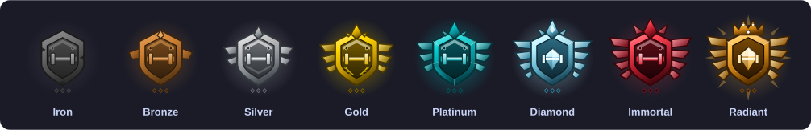
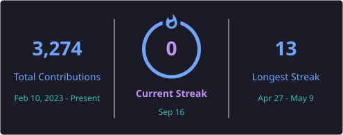

---

### About me

Full-Stack Engineer with **3+ years of experience** building production software end to end. Currently Product Owner & Full-Stack Engineer at **GUNDO Health and Food** (Spain, remote), leading an AI multiagent engine in production on **Google Cloud** and **AWS**, plus the web and mobile apps (React, Next.js, React Native) on top of it.

- 🔭 Technical lead for the **Fitness** vertical of a white-label B2B2C platform used by Uvesco, Ametller Origen and DIA.
- 🧠 Designed a multiagent training/nutrition engine (**Mastra**, **Vertex AI**, **OpenAI**) with event-driven processing over Google Cloud Pub/Sub
- 🏆 Built **GENIE**, a personalized nutrition engine (genetic + microbiome data) — winner of the European **DRG4FOOD** grant (€300,000), with ADN Institut (Spain) and i3S (Portugal)
- 📸 Built a computer-vision dish scanner: ingredient recognition and macro calculation from photos
- 🔐 Evolved the engine to a multi-tenant architecture and hardened API security (CORS, JWT, App Check)
- 🌱 Currently studying System Engineering at UNAD (Colombia)

---

### Tech stack

**Languages**
 

**Frontend & Mobile**
 

**Backend**
 

**Cloud, Data & AI**
 

**Testing**
 

---

### Featured work

**[Shelvora](https://github.com/Ricardoarsv/Shelvora)** — *Every story, on your shelf.* Offline-first Android web-novel reader: content-hashed multi-source downloads, hybrid on-device translation (ML Kit), 7-site engine, remote integrity gate. Plan-first dev orchestrated by AI across 16 phases.
`React Native` · `New Architecture` · `Hermes` · `Expo` · `ML Kit` · `Gradle`

**Rival** — gym lifting app with a competitive ranked ladder (private repo, built with a collaborator). Log the Big 3 — Squat, Bench, Deadlift — earn ELO from your Wilks score, and climb an 8-tier ladder across seasons. I'm the primary contributor (6 merged PRs, ~94% of contribution activity), including the PR that introduced the AI-first, spec-driven development architecture the whole codebase now runs on.
`Expo` · `React Native` · `Hono` · `Drizzle ORM` · `PostgreSQL` · `BetterAuth` · `RevenueCat` · `Turborepo`

---

### AI products I'm building (private repos, in active development)

- **InkLens** — AR tattoo preview app: 3D designs rendered live on your own skin via on-device body tracking (MediaPipe), no server upload of your photo unless you opt in. Next.js 14, Three.js / React Three Fiber, Turborepo monorepo, Stripe, Cloudflare R2, Sentry/PostHog.
- **Atelierum AI** — turns a photo of a garment into a ready-to-cut sewing pattern (SVG/DXF/PDF) using Gemini Vision + computer vision for measurement estimation. Cuts a 2–4 hour manual task down to ~20 seconds. Next.js + FastAPI, 130+ passing tests.
- **TestMind** — mobile personality/trivia quiz app monetized with AdMob (banner, interstitial, rewarded), built with Expo Router and Reanimated.
- **chunk-learner** — language-learning app built around spaced "chunks" with AI-driven voice conversation practice. Expo + TypeScript.

---

### GitHub stats

Cards above are generated by a GitHub Actions workflow in this repo (<code>.github/workflows/update-profile-cards.yml</code>) and committed as static SVGs — no dependency on third-party demo servers, so they don't go down. Runs nightly, on push, or on demand from the Actions tab.

---

📫 **Let's talk:** [ricardoarsv.2004@gmail.com](mailto:ricardoarsv.2004@gmail.com) · [LinkedIn](https://linkedin.com/in/ricardoarsv) · [rickdev.tech](https://rickdev.tech)

